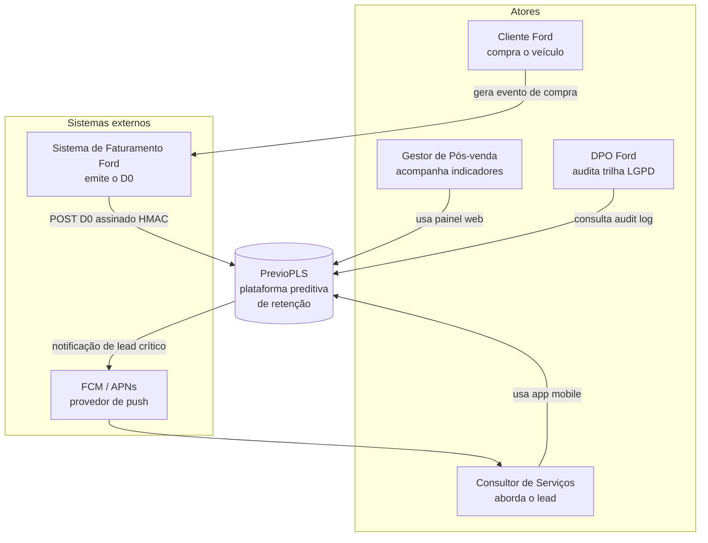
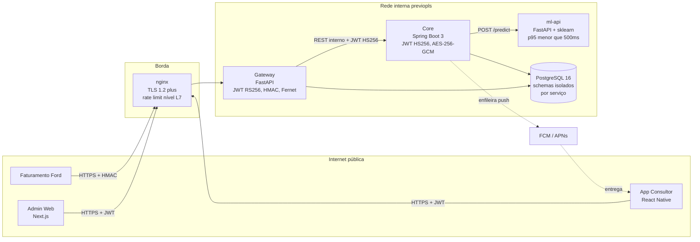
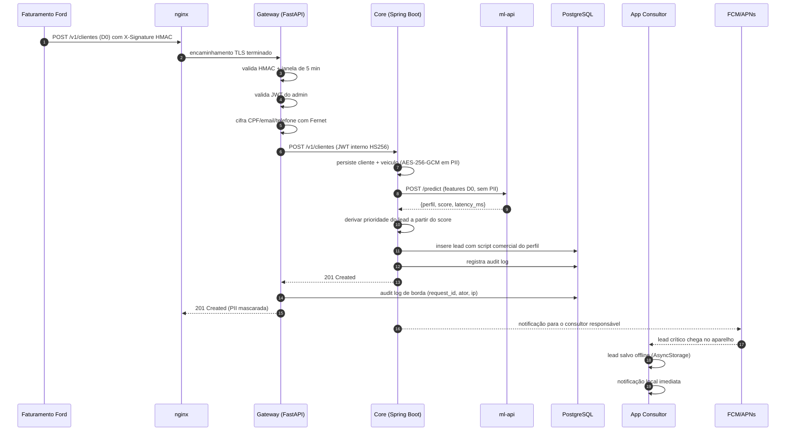
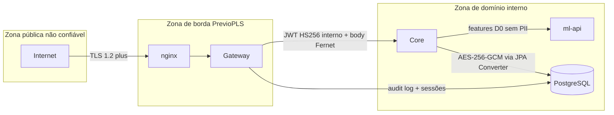
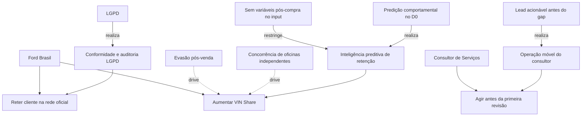
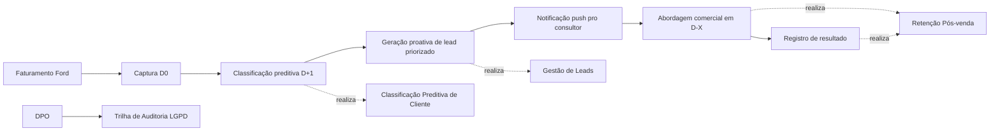
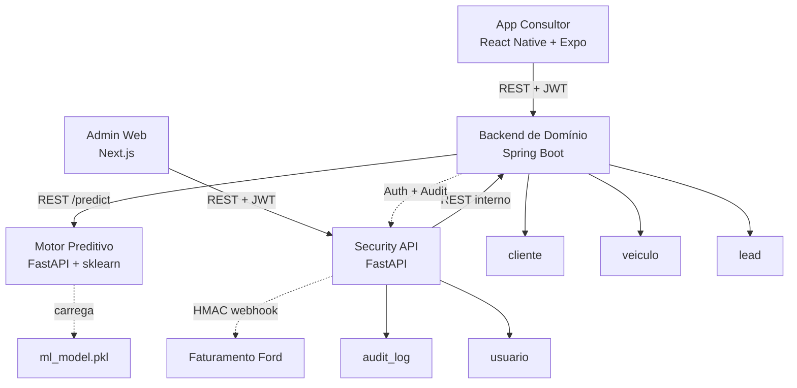
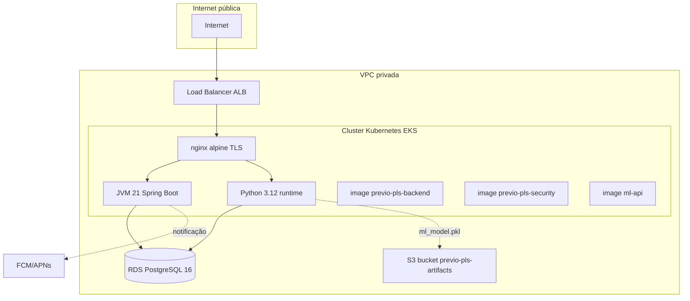

# Arquitetura PrevioPLS

Este documento descreve o sistema do ponto de vista de quem precisa avaliá-lo. Cobre contexto, containers, fluxo crítico, fronteiras LGPD e decisões arquiteturais que merecem ficar registradas. Complementa o modelo TOGAF formal em [`docs/previopls.archimate`](docs/previopls.archimate).

## Sumário

1. Contexto (C4 nível 1)
2. Containers (C4 nível 2)
3. Fluxo D0 ponta a ponta (sequence)
4. Fronteiras de confiança e LGPD
5. Tradução do modelo ArchiMate em prosa
6. Registros de decisão arquitetural (ADRs)

## 1. Contexto (C4 nível 1)

O sistema só existe no momento em que a venda é faturada. O gatilho é externo (faturamento Ford). A partir daí, todo o ciclo de classificação, geração de lead e abordagem acontece dentro do PrevioPLS, com push externo apenas para acordar o app do consultor.

## 2. Containers (C4 nível 2)

Decisões expressas no diagrama:

- O `nginx` é o único container exposto na rede pública.
- O `Gateway` faz tudo que tem cara de borda LGPD (TLS, JWT externo, HMAC, rate limit, audit, masking de PII em logs).
- O `Core` faz tudo que tem cara de domínio (cliente, veículo, lead, classificação, scripts comerciais).
- O `ml-api` é um serviço pequeno e dedicado à inferência. Não tem acesso a PII e nem precisa.
- O banco é compartilhado fisicamente mas separado por schemas, permitindo migrar para clusters independentes sem refatorar acesso.

## 3. Fluxo D0 ponta a ponta

Pontos importantes:

- A PII em claro aparece em duas camadas (Gateway no Fernet, Core no AES-256-GCM). Defesa em profundidade explícita, ver ADR-004.
- O ml-api recebe apenas as features D0. Não tem CPF, nome ou contato.
- O ciclo de auditoria escreve duas vezes: borda (Gateway) e domínio (Core). Eventos correlacionados pelo `request_id` propagado em header.
- O push é assíncrono. O sucesso da API não depende da entrega real ao aparelho.

## 4. Fronteiras de confiança e LGPD

Mapa de PII e proteção:

| Dado            | Origem            | Em trânsito           | Em repouso                  | Em log         | Em resposta     |
|-----------------|-------------------|------------------------|------------------------------|----------------|------------------|
| CPF             | Faturamento       | TLS + HMAC body        | Fernet (Gateway) + hash HMAC | Mascarado      | Mascarado        |
| Email           | Faturamento       | TLS + HMAC body        | Fernet (Gateway) + AES-256-GCM (Core) | Mascarado | Mascarado |
| Telefone        | Faturamento       | TLS + HMAC body        | Fernet (Gateway) + AES-256-GCM (Core) | Mascarado | Mascarado |
| Nome            | Faturamento       | TLS                    | Plaintext (sem busca por igualdade) | Sem masking automático | Visível ao consultor autorizado |
| VIN             | Faturamento       | TLS                    | Plaintext (chave de negócio) | Visível        | Visível          |
| Score / perfil  | ml-api            | TLS interno            | Plaintext                    | Visível        | Visível          |

Outras decisões LGPD relevantes:

- Anonimização programada de PII após 5 anos pelo `retention_service` (Gateway).
- Direito à explicação atendido por SHAP global e por feature importance documentada no [`ml-report.md`](docs/ml-report.md).
- Revisão humana garantida pelo PATCH manual de status no lead (consultor sobrescreve a recomendação automática).
- DPO acessa `audit_logs` via endpoint admin com RBAC `Analista`.

## 5. Tradução do modelo ArchiMate em prosa

O modelo completo em [`docs/previopls.archimate`](docs/previopls.archimate) tem 4 views Open Group ArchiMate 3. O resumo abaixo cobre cada view com diagrama Mermaid equivalente.

### View 01, Architecture Vision

Três capacidades sustentam a estratégia: inteligência preditiva no D0, operação móvel do consultor e conformidade LGPD com trilha de auditoria. A restrição central, sem variáveis pós-compra, define o teto pragmático do modelo e justifica a opção por enriquecer com dados D0 mais ricos no roadmap (sociodemográfico de CEP, score de crédito).

### View 02, Business Architecture

A jornada operacional é linear no caso feliz: faturamento gera o D0, o modelo classifica, o backend gera lead se o perfil for de risco, o consultor recebe e age, o resultado volta para o sistema. Cada passo é um processo de negócio observável e gera eventos auditáveis.

### View 03, Application Architecture

Quatro componentes principais, cada um corresponde a um dos repositórios originais da challenge consolidados via subtree neste monorepo. O novo serviço `ml-api` substitui o stub SHA-256 do Core e isola a dependência de scikit-learn fora da JVM.

### View 04, Technology and Physical

O target de deploy do modelo TOGAF é AWS (EKS + ALB + RDS + S3). O alvo prático do piloto, descrito na seção 6, é Railway com a mesma topologia conceitual (containers gerenciados, banco gerenciado, serviços privados). A separação não muda o desenho lógico.

## 6. Registros de decisão arquitetural

Cada ADR registra contexto, decisão e consequência, no estilo Michael Nygard. São quatro decisões que merecem ficar explícitas porque qualquer leitor as questionaria se não estivessem documentadas.

### ADR-001, Separação Gateway + Core

Contexto. A challenge gerou dois backends, um Python (Cybersecurity) e um Java (SOA), que reimplementam endpoints semelhantes. A primeira tentação é eliminar a duplicação consolidando em um único serviço.

Decisão. Manter os dois como camadas distintas. O Gateway Python fica como borda de segurança LGPD. O Core Java fica como serviço de domínio na rede interna. O Gateway é o único ponto exposto. O Core só aceita tráfego do Gateway.

Consequência. Reaproveitamos os controles maduros de ambos os repositórios (Fernet, HMAC, RS256, RBAC, audit) sem trabalho adicional. Pagamos um hop de rede a mais em cada requisição. Em troca, ganhamos defesa em profundidade real, com duas implementações independentes de validação, dois algoritmos de criptografia em PII e dois mecanismos de assinatura JWT. Operacionalmente, o Gateway pode escalar separadamente sob ataque (que é um padrão típico de borda) sem que o Core seja arrastado junto.

### ADR-002, scikit-learn standalone via FastAPI

Contexto. O Core é Java. O modelo é treinado em Python (scikit-learn). Embedar o motor de inferência no Java exigiria uma das três rotas: re-implementar features e algoritmo em Java, usar uma JVM Python (Jython, GraalVM com PolyglotEngine) ou carregar o pickle via uma ponte fora da JVM. As três alternativas pagam custo em manutenção ou em performance e nenhuma elimina a dependência de scikit-learn no processo Java.

Decisão. Criar um serviço dedicado `ml-api` em FastAPI que carrega o `ml_model.pkl` exportado do notebook e expõe `POST /predict`. O Core consome via REST interno com timeout de 2 segundos e fallback para perfil `ESQUECIDO` com score 0.5 se o ml-api estiver indisponível, mantendo o request principal saudável.

Consequência. Os times de ML (Python) e de domínio (Java) ficam acoplados apenas pelo contrato JSON do `/predict`. Reprocessar um modelo novo é apenas refazer o pickle e subir uma nova versão do container do ml-api. O Core não precisa saber qual algoritmo está rodando. O custo extra é uma chamada HTTP por classificação, mitigado pelo alvo de p95 menor que 500ms e por hot path em memória dentro do FastAPI.

### ADR-003, JWT RS256 na borda e HS256 internamente

Contexto. O Gateway emite JWT para clientes externos (mobile, admin web, integrações). O Core também tem seu próprio JWT para sessões internas. Unificar em um único algoritmo simplificaria a configuração.

Decisão. Manter RS256 na borda e HS256 internamente. O Gateway usa par RSA 2048 com chave privada em arquivo (KMS em prod). O Core usa segredo simétrico de 32 bytes. Os tokens não se atravessam: o Gateway gera um JWT interno novo quando chama o Core.

Consequência. Atacantes externos que comprometem o Gateway não conseguem forjar tokens internos do Core (não têm o segredo HS256). Atacantes internos que de alguma forma extraem o segredo HS256 não conseguem emitir tokens válidos para o público externo (não têm a chave privada RS256). A rotação independente de segredos fica natural. O custo é configuração dupla de segredos, mitigado por variáveis de ambiente explícitas e validação no boot.

### ADR-004, Fernet no Gateway e AES-256-GCM no Core para PII

Contexto. PII passa duas vezes pelo sistema: chega no Gateway via webhook e segue para o Core que a persiste. Unificar em um único algoritmo simplificaria a manutenção criptográfica.

Decisão. O Gateway cifra com Fernet (AES-128-CBC + HMAC-SHA256). O Core cifra com AES-256-GCM via `JPA AttributeConverter`. Cada camada gerencia sua própria chave.

Consequência. Vulnerabilidades em uma das duas bibliotecas não comprometem a outra. O ciphertext do Gateway é descriptografado e re-criptografado pelo Core antes de tocar o disco. Em log e dump de banco, mesmo plaintexts geram ciphertexts diferentes em ambas as camadas (IV aleatório por chamada nos dois algoritmos). O custo é dupla manutenção de chaves, aceitável dado o ganho em defesa em profundidade real. O risco residual conhecido é vazamento simultâneo das duas chaves, situação que já implica comprometimento total do ambiente e cuja mitigação cabe ao processo operacional (KMS, rotação, separação de duty).
