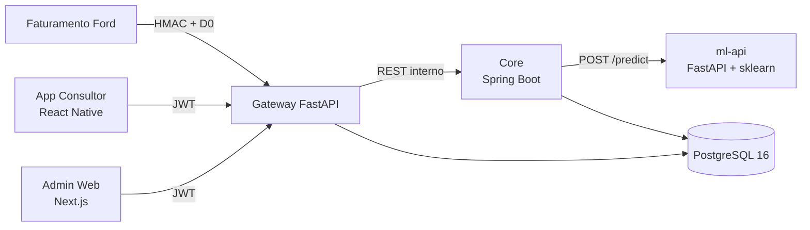

# PrevioPLS

Plataforma preditiva de retenção pós-venda. Classifica o comprador no exato momento da compra (D0) para permitir ação comercial antes da primeira revisão, sustentando o VIN Share da rede oficial Ford.

## O problema

A concessionária não sabe, no ato da venda, qual cliente deixará de retornar para revisões. Quando o CRM percebe o abandono, o cliente já criou hábito em oficinas paralelas. Campanhas genéricas tratam fiéis e clientes em risco da mesma forma, desperdiçando margem e perdendo justamente quem é recuperável.

## A solução

PrevioPLS classifica cada novo comprador em um de 4 perfis comportamentais (Fiel, Abandono, Esquecido, Econômico) usando apenas variáveis disponíveis no D0. Quando o perfil é de risco, a plataforma gera um lead priorizado que chega no app do consultor com script comercial específico. A ação acontece antes do gap de manutenção, no janela em que ainda existe relacionamento.

## Arquitetura em uma vista


```mermaid
graph LR
    Fat[Faturamento Ford] -->|HMAC + D0| GW[Gateway FastAPI]
    App[App Consultor<br/>React Native] -->|JWT| GW
    Web[Admin Web<br/>Next.js] -->|JWT| GW
    GW -->|REST interno| Core[Core<br/>Spring Boot]
    Core -->|POST /predict| ML[ml-api<br/>FastAPI + sklearn]
    Core --> DB[(PostgreSQL 16)]
    GW --> DB
```

O Gateway é a borda pública. Termina TLS (nginx), valida JWT RS256, aplica rate limit e RBAC, verifica HMAC nos webhooks de faturamento, registra a trilha de auditoria e repassa `/v1/clientes` e `/v1/leads*` ao Core na rede interna com um JWT interno HS256 de curta duração (`CORE_API_URL` + `JWT_SECRET`, ADR-001/ADR-003). O Core persiste o domínio (cliente, veículo, lead), cifra PII em repouso e delega a classificação ao ml-api. Detalhes em [`ARCHITECTURE.md`](ARCHITECTURE.md).

## Stack consolidada

| Camada                | Tecnologia                                                   |
|-----------------------|--------------------------------------------------------------|
| Edge de segurança     | FastAPI, Pydantic v2, nginx, Fernet, JWT RS256, HMAC-SHA256  |
| Domínio               | Java 21, Spring Boot 3.3, Hibernate, Flyway, AES-256-GCM     |
| Inferência            | Python 3.12, scikit-learn, FastAPI, joblib                   |
| Persistência          | PostgreSQL 16                                                |
| App consultor         | React Native 0.74, Expo SDK 51, TypeScript                   |
| Painel de gestão      | Next.js 14, Tailwind, shadcn/ui, Recharts                    |
| Orquestração local    | Docker Compose                                               |
| Deploy alvo           | Vercel (admin-web) + Render (gateway, core, ml-api) + Neon (Postgres) |

## Como rodar localmente

Pré-requisitos: Docker e Docker Compose v2. Nenhum passo manual de chaves ou certificados.

```bash
docker compose -f infra/docker-compose.yml up --build
```

A stack sobe nesta ordem (com healthchecks): PostgreSQL, certgen (certificado TLS self-signed, uma vez), ml-api, Core, Gateway, Admin Web, nginx. No primeiro boot o Core aplica o Flyway (schema + seed de 300 clientes / 93 leads) e o Gateway aplica o Alembic, gera o par RSA de desenvolvimento e cria os usuários padrão. O nginx expõe as portas 80 e 443; o Core fica em `127.0.0.1:5000` apenas para o app mobile em dev; todo o resto roda na rede interna `previopls`.

Acessos:

- Painel administrativo: `https://localhost`
- API pública (Gateway): `https://localhost/api/v1/...` · health em `https://localhost/api/health`
- Swagger do Gateway: `https://localhost/api/docs` (apenas em dev)
- Swagger do Core: `http://localhost:5000/docs` (apenas em dev, loopback do host)
- Login padrão de demo: `admin@ford.com / admin123` (admin), `consultor@ford.com / cons123` (consultor), `analista@ford.com / analista123` (analista, somente leitura; existe apenas no Gateway)

Aceite o warning de certificado self-signed em dev. Para trocar os segredos de desenvolvimento, copie `infra/.env.example` para `infra/.env`. Os detalhes de cada serviço estão em [`infra/README.md`](infra/README.md) e nos READMEs de cada pasta.

### Rodar sem Docker

Cada serviço também sobe isolado (Postgres local, `mvn spring-boot:run`, `uvicorn`, `npm run dev`). O caminho completo, incluindo o Gateway em modo proxy apontando para o Core, está descrito em [`infra/README.md`](infra/README.md#rodar-sem-docker).

### Verificação contínua

O workflow [`.github/workflows/ci.yml`](.github/workflows/ci.yml) roda em cada push e pull request: testes do Core (`mvn test`), do Gateway e do ml-api (`pytest`), typecheck + build do admin-web, typecheck do app mobile e validação do `docker-compose.yml`.

## Como o modelo entra em produção

O `MlService` do Core chama `POST /predict` no ml-api por REST interno. O ml-api carrega o `ml_model.pkl` exportado pelo notebook em [`services/ml/notebook/`](services/ml/notebook/) e devolve `(perfil, score, latency_ms)`. A validação anti-leakage roda no boot do ml-api e falha o startup se aparecer qualquer feature pós-venda no pipeline.

O modelo treinado no notebook usa o Online Retail (UCI) como proxy metodológico. Para regerar o `ml_model.pkl` com o dataset Ford real (`vin_share_Desafio_02.xlsx`, não versionada), execute [`scripts/retrain-with-ford-data.sh`](scripts/retrain-with-ford-data.sh) apontando para o arquivo local.

## Documentação

- [`docs/pulse-deck.pdf`](docs/pulse-deck.pdf): apresentação executiva (24/05/2026).
- [`docs/whitepaper.md`](docs/whitepaper.md): visão técnica de 6 a 10 páginas para o stakeholder Ford.
- [`docs/threat-model.md`](docs/threat-model.md): STRIDE em 5 domínios sobre a superfície LGPD.
- [`docs/ml-report.md`](docs/ml-report.md): decisões do modelo, métricas e limitações.
- [`docs/previopls.archimate`](docs/previopls.archimate): modelo TOGAF completo (4 views Open Group ArchiMate 3).
- [`ARCHITECTURE.md`](ARCHITECTURE.md): C4, sequence, ADRs, fronteiras LGPD.
- [`infra/README.md`](infra/README.md): compose local, rotas do nginx, variáveis, como rodar sem Docker.
- [`BUSINESS_CASE.md`](BUSINESS_CASE.md): caso de negócio em construção, com placeholders dos números públicos a preencher.

## Estrutura do monorepo

```
previopls/
├── README.md
├── ARCHITECTURE.md
├── BUSINESS_CASE.md
├── .github/workflows/ci.yml   Testes e builds de todos os serviços
├── docs/
│   ├── pulse-deck.pdf
│   ├── whitepaper.md
│   ├── threat-model.md
│   ├── ml-report.md
│   └── previopls.archimate
├── services/
│   ├── gateway/             FastAPI · borda LGPD (JWT RS256, HMAC, rate limit, audit) → proxy para o Core
│   ├── core/                Spring Boot · domínio (cliente, lead, classificação)
│   └── ml/
│       ├── notebook/        Jupyter · segmentação + classificação D0
│       └── api/             FastAPI · servidor de inferência para o Core
├── apps/
│   ├── consultor-mobile/    React Native + Expo · app do consultor
│   └── admin-web/           Next.js · painel para gestor de pós-venda
├── infra/
│   ├── docker-compose.yml   Stack completa (postgres, certgen, ml-api, core, gateway, admin-web, nginx)
│   ├── nginx/               TLS + rate limit + roteamento /api → gateway, / → admin-web
│   └── deploy/              Specs por serviço (Vercel, Render, Neon)
└── scripts/
    └── build-seed/          Gerador de seed determinístico a partir do dataset Ford
```

Cada serviço mantém seu próprio README com setup detalhado, variáveis de ambiente e fluxo de uso. Os 4 repositórios originais da challenge ficam congelados em avaliação acadêmica. Este monorepo é a versão de produto.
