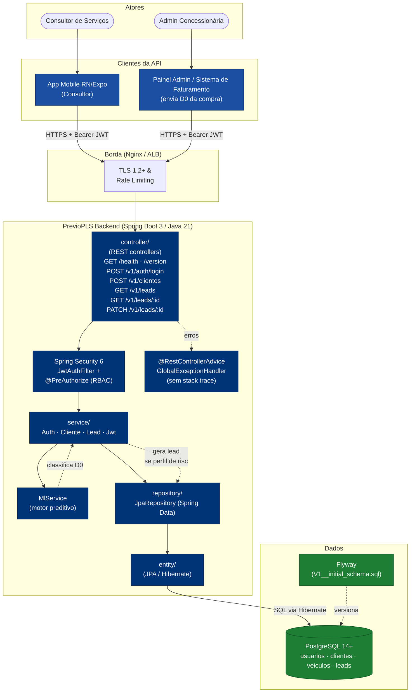
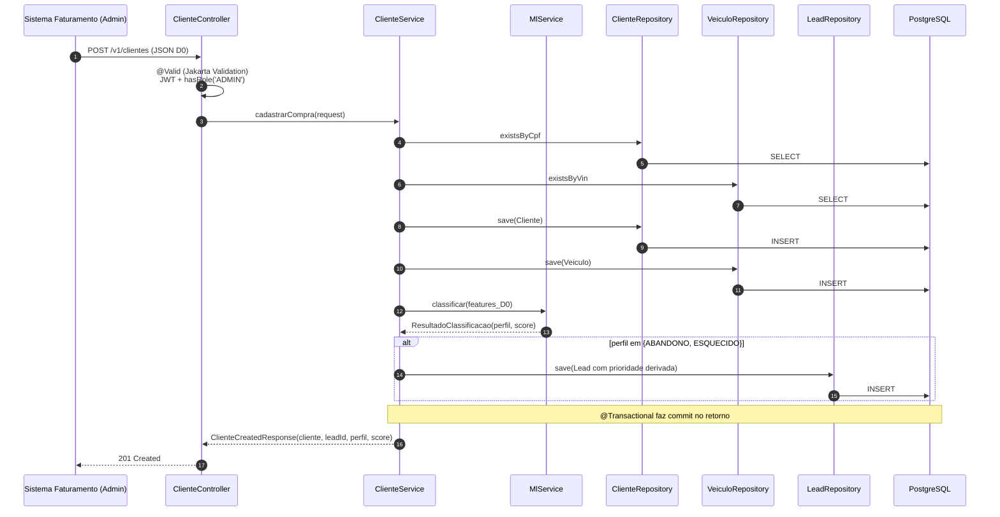
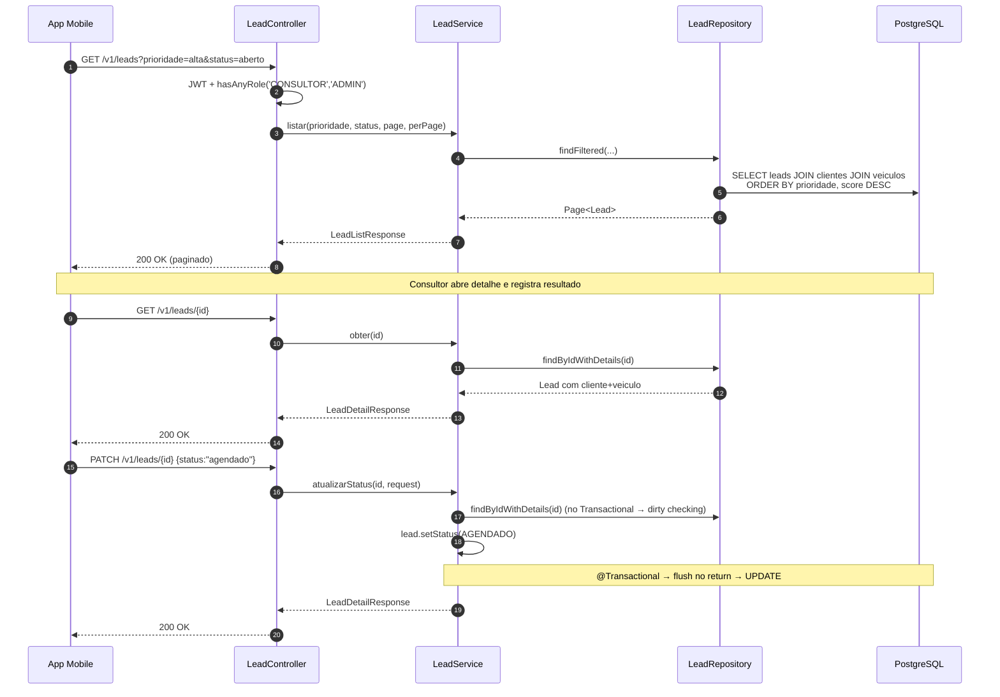
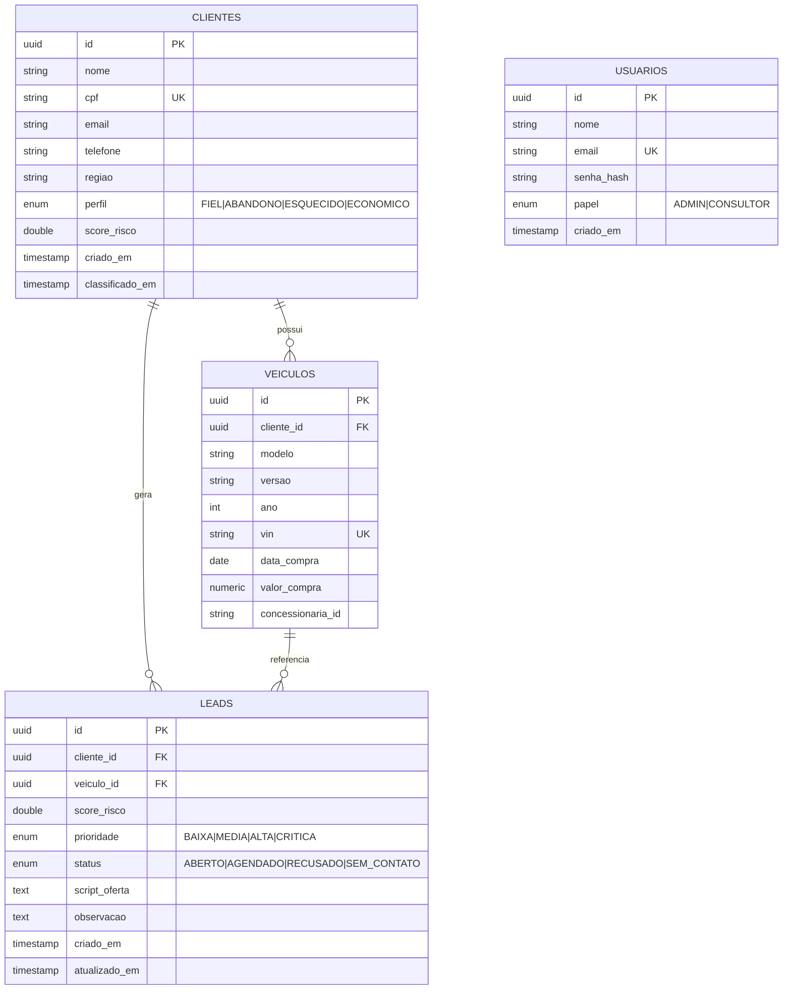

# Arquitetura — PrevioPLS Backend

## Diagrama de componentes (alto nível)

## Sequence — POST /v1/clientes (cadastro D0 da compra)

## Sequence — GET /v1/leads + PATCH /v1/leads/:id (app mobile)

## Modelo de dados (ER)

## Camadas SOA — responsabilidades

| Camada           | Responsabilidade                                                    | Onde                                              |
|------------------|---------------------------------------------------------------------|---------------------------------------------------|
| **Apresentação** | Roteamento HTTP, validação (`@Valid` + Jakarta), serialização DTO   | `controller/`, `dto/`                             |
| **Serviço**      | Regra de negócio, orquestração, transações (`@Transactional`)        | `service/` (Auth, Cliente, Lead, Ml, Jwt)         |
| **Dados**        | Acesso ao banco via Spring Data JPA — sem regra de negócio          | `repository/`, `entity/`                          |
| **Infra**        | Security (JWT, RBAC), CORS, OpenAPI, conversão de enums, erro global| `config/`, `exception/`                           |

A separação garante:
- **Reuso**: `LeadRepository.findFiltered` é usado pelo `GET /v1/leads` e pode ser reusado em jobs de relatório.
- **Testabilidade**: services dependem de interfaces `JpaRepository` e são testados isoladamente com Mockito (ver `src/test/java/com/previopls/service/ClienteServiceTest.java`).
- **Substituibilidade**: trocar Postgres por outro banco JPA não afeta controllers/services.
- **Versionamento de contrato**: endpoints de negócio ficam sob `/v1/`; mudanças incompatíveis podem coexistir em `/v2/` sem quebrar o app mobile já distribuído.
- **Observabilidade**: `/health` (com sonda no banco via `JdbcTemplate`) e `/version` ficam fora do versionamento — alvo de k8s probes, ALB health checks e dashboards.
